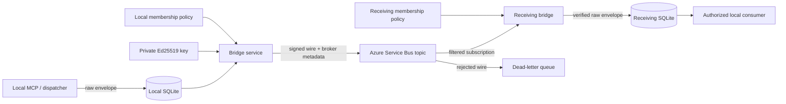

# Balcony Agent Bridge Threat Model

## 1. System Overview

### Scope

This model covers the v0.1 multi-node message path: a local MCP process writes
an unchanged `BridgeEnvelope` to SQLite, the bridge signs it immediately before
Service Bus send, the receiving bridge verifies the signed wire and broker
metadata before persistence, and the local consumer later claims the durable
envelope. It does not claim that an authorized peer, local administrator,
registered project, or agent response is trustworthy.

### Components And Effective Resources

| Component | Effective resource or privilege | Security role |
|---|---|---|
| MCP and optional dispatcher | Local SQLite file; no Service Bus or signing-key access | Create and consume durable envelopes |
| Bridge service | SQLite, private signing key, public membership file, broker sender, own subscription receiver | Only signed production ingress/egress boundary |
| Private identity file | Machine-local Ed25519 PKCS8 PEM | Proves the local node's message origin |
| Membership file | Network ID, exact remote-node set, active/revoked public keys | Operator-controlled trust root |
| Service Bus topic | Send permission for configured node principals | At-least-once transport; does not prove `origin_system` |
| Node subscription | Receive permission for that node and exact `bridgeTarget` filter | Broker-side routing reduction |
| SQLite inbox/outbox | Full validated envelopes and delivery state | Durable replay/idempotency evidence |
| Dead-letter queue | Rejected broker messages | Operational evidence; may still contain the original broker body |

### Implemented Security Boundary

- The production bridge loads message authentication separately from the MCP
  profile (`src/config.ts:332`, `src/bridge/index.ts:17`).
- The signer covers the full strict wire wrapper, including the unchanged
  envelope, network, key ID, issue time, and expiry
  (`src/security/message-authentication.ts:115`).
- Verification requires the local target, an exact configured peer, an active
  matching Ed25519 key, the same network, a bounded lifetime, and a valid
  signature (`src/security/message-authentication.ts:146`).
- Service Bus ingress verifies before constructing the worker delivery and
  compares all security-relevant broker metadata with the authenticated
  envelope (`src/transport/service-bus-transport.ts:110`,
  `src/transport/service-bus-transport.ts:252`).
- Authentication failures are dead-lettered with fixed, body-free text
  (`src/transport/service-bus-transport.ts:118`).
- The Windows installer rejects broad credential reads and runtime inputs with
  untrusted owners or write access
  (`scripts/BridgeServiceSecurity.psm1:14`,
  `scripts/Install-BridgeService.ps1:88`).
- The durable envelope and SQLite schema are unchanged. Duplicate suppression
  remains message-ID based, while a different origin cannot quarantine the
  existing row by reusing its ID (`src/storage/database.ts:848`,
  `src/storage/database.ts:858`).

## 2. Threat Model

### Trust Boundaries And Assumptions

1. The local operating-system administrator and bridge service account can read
   or replace local policy, binaries, SQLite, and keys; they are trusted for
   this deployment.
2. Public enrollment entries are authenticated out of band before an operator
   copies them into membership policies.
3. Azure Service Bus and TLS provide availability and transport protection, but
   broker send authorization is not treated as proof of the claimed node.
4. Node clocks are synchronized closely enough for the five-minute future-issue
   tolerance.
5. Authorized peers may be buggy or compromised. Authentication identifies the
   configured key; it does not make that peer's content safe or correct.
6. MCP authorization is local/stdio and relies on operating-system process and
   file boundaries. This phase does not add remote MCP authentication.

### Threats And Controls

| ID | Threat | Implemented control | Residual risk |
|---|---|---|---|
| S-01 | Broker sender claims another `origin_system` | Ed25519 verification selects the public key under the signed envelope origin; spoofed origin changes fail verification | A stolen node key can impersonate that node until policy revocation reaches every receiver |
| S-02 | Valid message from another bridge network is replayed | Signed `network_id` must equal local membership | Operators can accidentally reuse the same network ID and keys across environments |
| T-01 | Payload, route, causality, kind, stream, or expiry is modified | Signature covers the entire strict wire and envelope; the existing envelope parser still checks its canonical payload hash | A compromised authorized signer can intentionally create harmful but valid content |
| T-02 | Broker metadata is changed independently of the body | Message ID, session, correlation presence/value, subject, target, schema version, and stream must match the verified envelope | Broker-level TTL is not treated as signed truth; signed/envelope expiry remains authoritative |
| R-01 | Sender denies having sent a message | Key ID and signature prove possession of a configured private key at ingress | The verified key ID is not added to durable SQLite, so long-term cryptographic audit depends on retained broker/policy evidence |
| I-01 | Error paths disclose message or key content | Authentication errors and DLQ descriptions are fixed and body-free; the dispatcher and MCP never load the signing key | Azure DLQ retains the original rejected broker body and must be access-controlled and retained deliberately |
| I-02 | Package or repository exposes credentials | Identity generation uses explicit local output and refuses overwrite; the installer rejects broad private-key reads; package/secret scans exclude private state | A local administrator can still weaken ACLs after installation |
| D-01 | Invalid messages exhaust receive/DLQ capacity | Invalid messages fail before SQLite and are dead-lettered once | Any principal with topic send permission can create broker/DLQ cost; application signatures do not replace Azure monitoring and RBAC |
| D-02 | Policy or key error prevents all traffic | Strict startup and no unsigned fallback make misconfiguration visible | Coordinated deployment is required; fail-closed behavior trades availability for integrity |
| E-01 | Attacker replaces local policy/key or bridge binary | Absolute regular non-symlink files, strict schemas, key derivation, and installer ACL checks reject untrusted runtime-input owners/writers | Per-file replacement races and a local administrator or compromised service account remain outside the application boundary |
| E-02 | Topic sender targets a subscription it should not use | Signed target must equal the receiving local node and broker target metadata must match | Topic-level send permission still lets a principal create rejected traffic for other subscriptions |
| P-01 | Revoked key remains usable | `revoked` and key validity windows are checked on every sign/verify startup policy | Policy distribution is manual; revocation is not instantaneous or centrally enforced |
| P-02 | Signed message is replayed | Expired wire is rejected before persistence; exact live replay is deduplicated by SQLite `message_id` | After SQLite loss/rebuild, an unexpired exact replay can be accepted again; consumers require idempotency |

### Security Invariants

- Production Service Bus traffic is signed. There is no unsigned compatibility
  fallback; legacy raw envelopes are never accepted.
- A verified envelope is delivered only to its named local node and only when
  the claimed origin has an active key in local membership.
- Local `authorizedNodeIds` and membership peers match exactly.
- Wire lifetime is at most seven days, cannot exceed envelope expiry, and
  cannot be issued more than five minutes in the future.
- Private signing material is never placed in the MCP profile, durable
  envelope, broker body, public enrollment JSON, log message, or npm artifact.
- Revocation affects future authentication. Previously verified SQLite rows are
  retained as evidence until an operator explicitly handles them.

## 3. Attack Surface

| Surface | Attacker capability | Expected behavior | Validation |
|---|---|---|---|
| Signed wire body | Submit malformed, unsigned, tampered, wrong-network, expired, unknown-key, or revoked-key content | Generic authentication dead-letter; no worker delivery or SQLite persistence | Foundation message-authentication tests and security transport-boundary tests |
| Broker metadata | Change identifiers, sessions, correlations, kind, route, schema, or stream | Generic authentication dead-letter | Service Bus authentication-boundary metadata matrix |
| Membership file | Add unknown fields, duplicate peers/keys, wrong key type/ID, or peer-list drift | Startup/configuration rejection | Foundation membership tests |
| Signing-key file | Supply relative, symlinked, oversized, non-PKCS8, or non-Ed25519 file | Startup/configuration rejection without value echo | Foundation authentication/config tests |
| Identity output | Pre-create or symlink output files; repeat generation | No overwrite; generic failure | Foundation identity and CLI integration tests |
| Authorized peer | Send valid but malicious task content or request an ungranted project | Exact active peer/resource grant plus enabled resource is required before project resolution, context loading, or execution. An authenticated known enabled ungranted claim is parked for local approval; unknown, disabled, and unauthenticated claims receive the same generic rejection and create no approval row | A granted peer can inspect the complete registered tree; filesystem review remains necessary |
| Local MCP caller | Read an explicitly requested inbox item | Message body may be returned by design | Local OS/process authorization; not expanded in Phase 4 |
| Azure principal | Publish to topic outside intended logical edge | Receiver rejects invalid signed target/origin, but broker/DLQ load remains | Azure RBAC/filter review plus runtime monitoring, owner-gated |

`peer_readable: true` is only the machine-local path eligibility gate. Durable
SQLite policy independently requires an enabled resource and an active grant
for the exact authenticated origin. Missing, disabled, revoked, malformed, or
unauthenticated state fails closed before project resolution. Schema v8 state
receives no grants automatically, and schema v9 preserves those grants while
adding empty local approval and append-only metadata-audit tables. One-time
approval is bound to the original request; temporary approval is bound to the
exact peer/resource pair and strict UTC expiry. Deny, revoke, and expiry fail
closed. Approval does not add a network control plane or change wire/MCP/live
service behavior.
File checks are intentionally defense in depth, not protection from a local
administrator: an attacker able to replace a file between validation and read,
or to control the bridge service account, is already inside the host trust
boundary.

Approval commands and SQLite data remain protected by local OS/process identity
trust. They do not add a remote operator identity boundary. Signer key IDs are
still not retained as a separate inbox audit field, which remains a low-severity
forensic limitation.

## 4. Severity Calibration

| Severity | Meaning in this project | Example |
|---|---|---|
| Critical | Remote unauthenticated code execution, private-key/credential disclosure, or universal authentication bypass | Any broker sender can forge every node and reach writable execution |
| High | Cross-node authorization bypass, accepted signature forgery, or message-body disclosure across a trust boundary | A key for node A is accepted as node B, or DLQ error text contains task bodies |
| Medium | Bounded integrity, replay, or availability failure requiring existing broker/local access | Unexpired replay is reprocessed after SQLite loss; a topic sender creates DLQ exhaustion |
| Low | Hardening, operator clarity, or auditability gap without a demonstrated boundary bypass | Verified signing key ID is not retained with the SQLite inbox row |

Rotation, revocation, coordinated cutover, and incident steps are defined in
[`docs/message-authentication.md`](message-authentication.md). Azure deployment,
RBAC changes, public publication, dynamic discovery, and remote MCP access are
outside this local Phase 4 implementation and remain separately owner-gated.

Repository: balcony-agent-bridge-open-source
Version: security snapshot `1e02b4ad427029c8a54d5e21613d0593c42d4690f993a77ac131c20c7438a60d`, based on `9468ab9ba82a57e67cda451c19b8c1c3e5a2a4f3`
